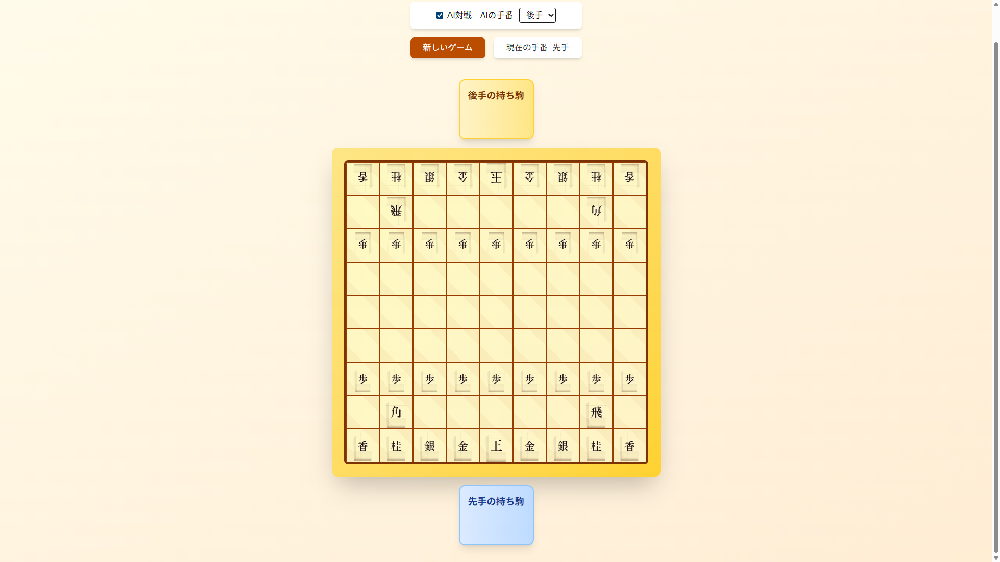

# 本格将棋ゲーム ♟️



**🎮 デモURL**: https://app005-syougi.vercel.app  
**⏱️ 開発時間**: 60分 | **📝 コミット数**: 5コミット | **🤖 作成者**: チャッピー  
**🛠️ 技術スタック**: Next.js, React, TypeScript, Tailwind CSS, Vercel

ブラウザで遊べる本格的な将棋ゲームです。ルールエンジンをちゃんと作って、合法手や王手判定もしっかり実装しています 🏆

## ✨ 主な機能

### 🎯 本格的なゲームルール
- **合法手判定**: すべての駒の動きルールを完全実装
- **王手・詰み判定**: 王手状態の検知と詰みの判定
- **成り駒システム**: 敵陣での駒の成り上がり
- **持ち駒機能**: 取った駒を自分の駒として使用可能
- **王手放置防止**: 王手状態を放置する手は指せません

### 🎨 ユーザー体験
- **盤面ハイライト**: 選択した駒の移動可能位置を表示
- **王手検知表示**: 王手状態を視覚的に警告
- **直感的操作**: クリックだけで簡単操作
- **美しいUI**: 木目調の盤面と伝統的な駒デザイン

### 🤖 AI対戦
- コンピューターとの対戦モード
- 適度な強さで楽しめる思考ルーチン

## 🎮 遊び方

1. **駒を選択**: 自分の駒（下側）をクリックして選択
2. **移動先を選択**: ハイライトされた移動可能位置をクリック
3. **持ち駒の使用**: 取った駒は盤面横の持ち駒エリアから使用可能
4. **勝利条件**: 相手の王様を詰ませたら勝利！

## 🚀 実行方法

### ローカル環境での起動

```bash
# 依存関係のインストール
npm install

# 開発サーバーの起動
npm run dev
```

ブラウザで http://localhost:3000 を開いてゲーム開始！

### 本番環境
デモサイトですぐにプレイできます: https://app005-syougi.vercel.app

## 🛠️ 技術仕様

### アーキテクチャ
- **モジュール分割**: 合法手・禁則・勝敗判定を独立したモジュールとして実装
- **状態管理**: ゲーム状態の一元管理で整合性を保証
- **エラーハンドリング**: 不正な手や例外状況への適切な対応

### 技術スタック
- **フロントエンド**: Next.js 15.5.2, React 19.1.0, TypeScript
- **スタイリング**: Tailwind CSS 4.0（レスポンシブデザイン）
- **開発環境**: Turbopack（高速ビルド）、ESLint
- **デプロイ**: Vercel（CDN配信で高速表示）


## 💡 開発で学んだこと

### 王手放置の問題解決
最初の実装では王手状態を放置する手が指せてしまう問題がありました 😅

**解決策**: チェック検知を移動後検証フェーズに集約
- 手を指す前に「移動後の盤面で自玉が王手になるか」をシミュレーション
- 王手になる手は不正として弾く仕組みを実装

### ルールエンジンの設計
- **分離の原則**: UI表示とゲームロジックを完全分離
- **テスタビリティ**: 各ルールを独立してテスト可能
- **拡張性**: 新しいルールや機能追加が容易

## 🎯 今後の改良予定

- [ ] AI強度の調整機能
- [ ] 棋譜の保存・再生機能  
- [ ] 持ち時間制限の実装
- [ ] 対人戦（オンライン対戦）機能
- [ ] 戦型解析・定跡表示


## 📝 フィードバック

実際にプレイしてみて、気づいた点やご意見があればお聞かせください！

---

**楽しい対局を！** ♟️✨